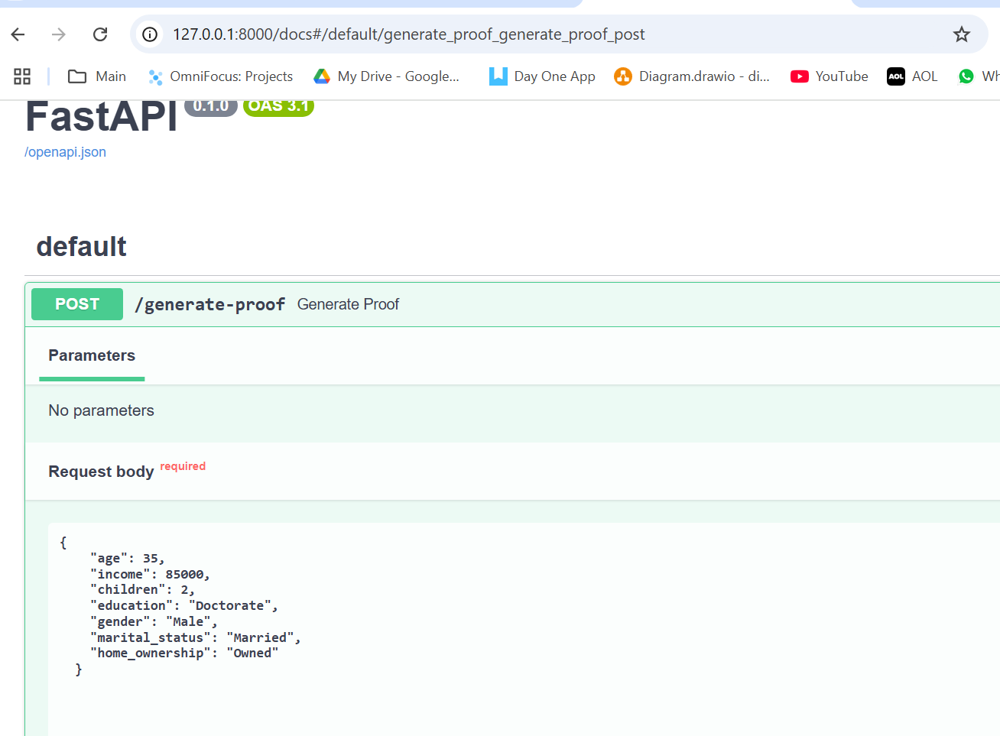
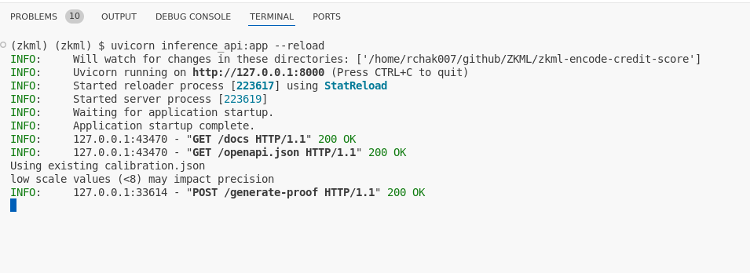
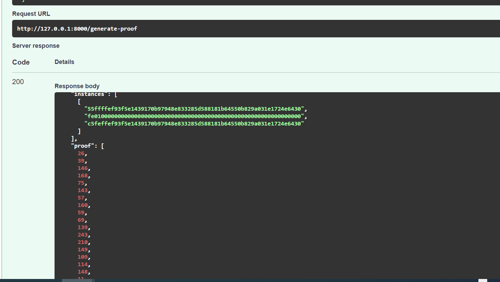

# zkml-encode-credit-score

## Main file  - 

((( OLD --- Jupyter notebook that was run on Google Colab
ezklCreditLoans.ipynb
ezklcreditloans.py - python version of same Jupyter notebook (same as jupyter notebook )
)))

## latest code pythong - trains model and creates proof
ezklCreditLoanPython.py - actual Python run final code.

# inference_api.py - API for inference

### To run:
uvicorn inference_api:app --reload

http://127.0.0.1:8000/docs
use json in testing1.json

### Testing 1

ran this inference - 

