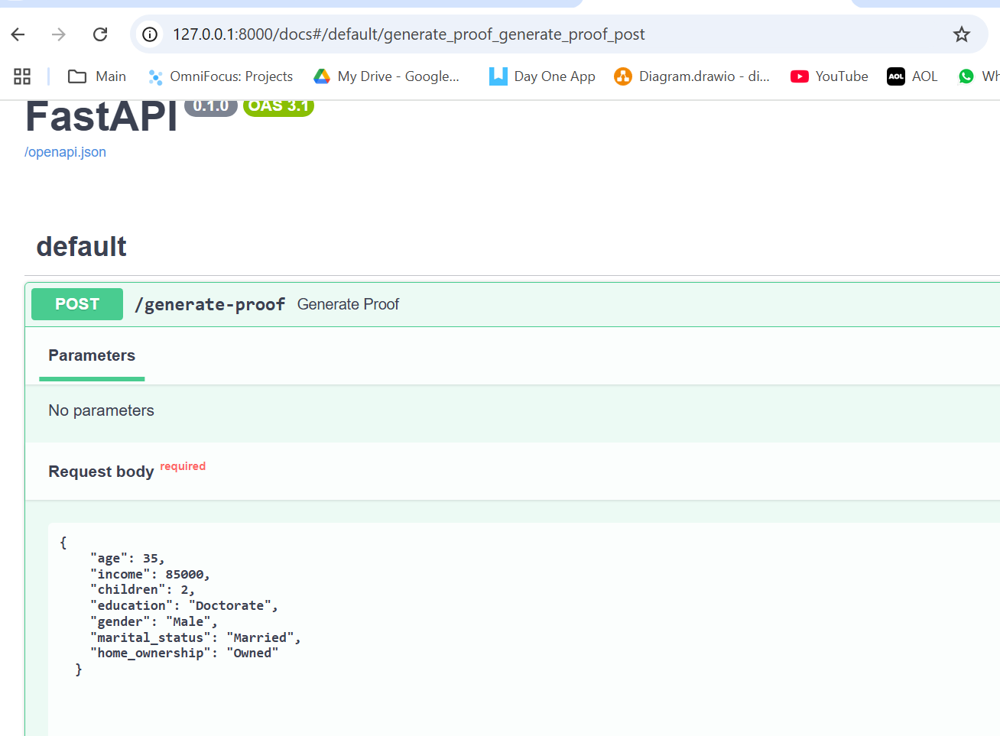
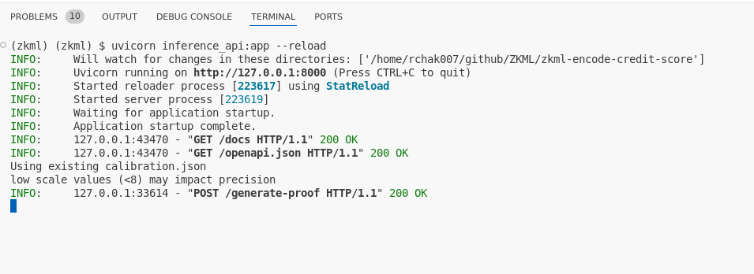

# ZKML Privacy preserving Credit Loans

## Run Info - 

Clone our repo.

environment.yml has python install info

Run `python ezklCreditLoanPython.py` to run the Training of model , generate EZKL proof and verification

Run `uvicorn inference_api:app --reload` to run the inference.

Open URL - http://127.0.0.1:8000/docs
and use json in testing1.json as sample.

## 🎯 **Objective**

Our project brings **privacy-preserving credit loans app** using **ZKML** (Zero-Knowledge Machine Learning).
We wanted to **predict a user's credit score** — *Low, Average, or High* — and **prove** that the classification came from a genuine ML model **without revealing any personal data**.
This score could then be used to decide how much **USDC loan** to offer the customer.

The neural network model used in your `ezklCreditLoanPython.py` script is a simple **3-layer fully connected feedforward neural network** built using **PyTorch**.

**<u>GITHUB</u>**

https://github.com/tenac1337/zkml-encode-credit-score

**<u>Testing</u>**

ran this inference - 

**<u>Smart Contract -</u>** 

- The python notebook generated the Verifier smart contract.
- We created the TokenLender contract which inherits the Verifier smart contract in order to utilise the verification logic
- The submitUnderwritingDecision method on the TokenLender contract takes as input the user address and the proof parameters. Once the proof parameters successfully verify, funds are sent to the user's address.
- This model assumes trust with the underwriter server in providing the correct user address that corresponds to the bundle of private user data they provided to the underwriter. This was a challenge that we did not know how to overcome.

------

## 🧠 **What We Built**

- We trained a **PyTorch neural network** using a custom dataset with features like income, age, education, etc.
- We then used **EZKL** to convert that model to ONNX and generate **zero-knowledge proofs** of its predictions.
- Finally, we exposed this via a **FastAPI endpoint** so anyone can:
  1. Submit input (like age, income),
  2. Get the predicted credit score,
  3. Receive a **ZK proof** that verifies the prediction was made correctly.

------

## ⚙️ **Tech Stack**

- **PyTorch** for model training
- **EZKL** for ZKML proof generation
- **ONNX** for model export
- **FastAPI** to serve inference and proof as an API
- **JSON & joblib** for model + preprocessor serialization

------

## 🛠️ How It Works (Code Flow)

- `ezklCreditLoanPython.py`:
  - Loads and preprocesses training data.
  - Trains and evaluates the model.
  - Converts to ONNX.
  - Generates + verifies a zero-knowledge proof using EZKL.
- `inference_api.py`:
  - Takes in live user data.
  - Predicts credit score.
  - Generates a **ZK proof** of that prediction.
  - Returns both.

------

## 💡 Real-World Impact

This system can power **decentralized loan platforms**. Imagine someone applies for a loan and gets a **verified credit score**, but **without ever revealing their salary, age, or education**.
 It’s private, trustworthy, and blockchain-ready.

------

## ✅ Status

- Working end-to-end!
- Screenshots captured for proof generation & verification.
- My teammate will show how we connect this to USDC lending logic.

